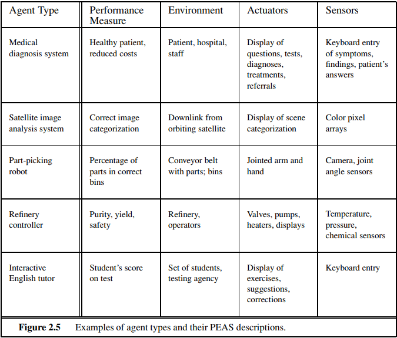

# Artificial intelligence
Artificial intelligence concerns itself with constructing an independent reasoning device. The field is vibrant and has produced some iteresting tools as a by-product, but a true artificial brain hasn't been developed yet. Whether it is actually possible to develop a *conscious* artificial brain is a matter of debate. 

What we've been able to do is to create a **weak AI** - machine performing specific tasks, not the full range of human activities (= **strong AI** or **[AGI](https://en.wikipedia.org/wiki/Artificial_general_intelligence)**).

When is a machine intelligent? There are multiple requirements, mostly revolving around these 4 categories: thinking/acting humanly/rationally

## How to operationally evaluate intelligence? - Turing test
Proposed by Alan Turing, quite rigorous, but whether a machine passing it can be considered truly intelligent is not so clear.

Critiques:
 * Turing test doesn't necessairly assume human behavior as a requirement for intelligence, but it requires an AI to 'trick' us into thinking it's humanly intelligence
 * we may never actually build a machine that passes a Turing test, so we should be focusing on building more intermediate benchmarks for assessing performance of AI systems
 * formally, the Turing tests has been most successfully challenged by the so-called [Chinese room experiment](https://rationalwiki.org/wiki/Chinese_room), showing that it is possible for a computer to behave as if it is intelligent, but in a purely mechanical way

 ## Other intelligence evaluation systems
 * [BLEU](https://en.wikipedia.org/wiki/BLEU) for assessing quality of text generated by machine translation from one lang. to another
 * [GLUE](https://arxiv.org/abs/1804.07461) - assessing natural language understanding

## Interesting questions related to constructing AI:
* how exactly does consciousness arise in a brain (i.e. at what point does brain become a mind)
* can we formulate laws governing rational reasoning? - Aristotle's syllogisms

 ## Related scientific fields
 * neuroscience
    * cognitive science
 * mathematics
    * logic
    * computation
    * probability theory
 * economy - how to make choices that lead to preferred outcomes
    * decision theory
 * linguistics
    * NLP
 * philosohpy
    * morality

### Philosophy of rationality / reasoning / metacognition
* distinction between mind and matter in regards to brain - Descartes' work - rationalism (power of reasoning in understanding the world), dualism (existence of spirit/soul outside of physical world)
* work of Locke, Hume, Wittgenstein, Russell leading to logical positivism - all knowledge can be characterized by logical theories connected to sensory inputs

### Computability
* Godel's incompleteness theorem - what if there's a true statements that doesn't have a proof: limits on deduction - in any formal theory as strong as the theory of natural numbers, there are true statements that are undecidable - they have no proof within the theory
    * challenges whether mathematics is really a consistent system we believe it to be
* this motivated Turing to formulate **which problems are computable** - Church-Turing thesis introducing the Turing machine, halting problem and the notion of **tractability**. A problem is called intractable if the time required to solve instances of the problem grows exponentially with the size of instances. **NP-completeness** theory deals with recognizing intractable instances.

Important thing to consider in this regard is **how knowledge is connected to actions**.

# Intelligent agents

Agent perceives its environment through **sensors** and acts upon it through **actuators**. Agent's action is based on **percept sequence**. Its behavior is described by **agent function**.
What makes a good (= **rational**) agent? - if the sequence of states the environment has gone though as a result of agent's actions is desirable - captured by a **performance measure**, so the goal of an agent becomes its **maximization**.

Examples of agent types:

Types of environments: 
- what is done to performance measure? 
   - If maximized by all agents collectively (e.g. taxi driver situation) = **cooperative**, If 2 agents play chess against each other = **competitive**.
- is the current state completely determined by sequence of pervious ones?
   - **deterministic**, otherwise **stochastic**
- does the current decision affect all the future ones?
   - **sequential**, otherwise **defective**

 Interesting reading/watching:
 * [Would AI that would be advanced enough to pass the Turing test intentionally fail it to save itself?](https://www.reddit.com/r/Futurology/comments/3dxuel/why_a_real_ai_would_not_intentionally_fail_a/)
 * [Computerfile - Godel's incompleteness theorem](https://www.youtube.com/watch?v=O4ndIDcDSGc)

