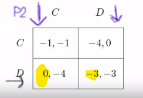
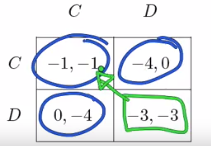

# Intro
Game theory is an extension of multi-agent environments, where these agent directly **compete** within an environment (= a game). We suppose this game is **zero-sum** (if 1 player wins, the other one loses), deterministic and fully-observable. Games are conventionally hard to solve (branching factor in chess is 35, so each search tree has $$35^100$$ nodes), they penalize inefficiency a lot and have no means of calculating optimal decision.

### Concepts:
- optimal move
- heuristic evaluation functions
- utility(=objective) function
- imperfect information
- prunning

Game theory in its most basic form works with a set of **players**, each having some **actions** available and **payoffs** associated with performing an action.

Initial state $$S_0$$, Actions(s) and Result(s,a) define a **game tree** - even for simple games such as tic-tac-toe, the tree is too large to be shown whole.

Next we need to formulate a **strategy**. In classical search problem, we need to specify a sequence of actions that lead to a goal state. In adversarial problems, a player's moves must take into accout every possible action of the opposite player.

#### Minimax
Given a game tree, the optimal strategy can be determined from the **minimax value**, the algorithm performs a complete depth-first exploration of the tree. Due to the time cost ($$O(b^d)$$) Minimax is very impractical, but serves as the basis for mathematical analysis and more practical algorithms.

## Defining games
- Representations: **Normal form** (lists what *payoffs* *players* get as a result of their *actions*), **extensive form** (includes timing of moves - represented as a tree )

## Crucial concepts

### **Dominant strategies**
There are different types of strategies (= choosing an action), some **dominate others**.
A dominant
strategy for a player is one that produces the highest payoff of any strategy available for
every possible action by the other players.
- strategy $$s$$ **strictly dominates** another possible one, when it doesn't matter what are the other players' strategies, player always benefits (gets more utility) from choosing $$s$$ over some other strategy
- weak dominance - similar, $$s$$ is always at least as beneficial than any other one
- conclusion: A strategy profile consisting of dominant strategies must be a Nash equilibrium
- Example: Prisoner's dilemma 
    - if P2 plays either C or D, P1's best strategy is always D, so **D is a strictly dominant strategy**

### **Nash equilibrium**
Each player knows the **equilibrium strategies of other players** and no player benefits from changing the strategy - each player’s strategy is the best response against the equilibrium strategies of the other players.
- weaker concept than dominant strategy: only requires that the action taken by each agent be best against the actual equilibrium of actions taken by the other players, and not necessarily against all possible actions of the other players

### **Pareto optimality**
From the point of an outside observer - are some *outcomes* of a game better than others?
- if outcome $$o$$ is at least as good **for every agent** as another outcome $$o'$$, then $$o$$ Pareto-dominates $$o'$$. $$o*$$ is optimal if there is no other outcome that dominates it
- every game has to have at least 1
- Example: Prisoner's dilemma

    - every outcome is pareto optimal except for (-3,-3) because it's Pareto-dominated by (-1,-1). The paradox of Prisoner's dilemma is 

## Mixed strategies
= Randomized strategy. E.g. in matching pennies there is no deterministic strategy to be played, so we choose mixed strategies to confuse the opponent by playing randomly. The only way we can be in equilibrium is when we confuse each other.
So far:
- **pure strategy** = one action is played with positive probability

Now:
- **mixed stratgy** = more than 1 action is played with positive probability = define strategy as a prob. distribution over actions
    - wht is the payoff? - use the idea of **expected utility** from decision theory
- notions of best respons and Nash equilibrium generalize to strategies = thm: **"Every finite game has a Nash equilibrium"** - that's why Nash equilibrium is such a powerful concept. No matter what game, there will always be this stable state, that if players knew what everyone else is doing, none of them would like to change their strategy. This theorem exists only in regards to mixed strategies, not pure ones.

### Computing Mixed Nash equilibria
Hard directly, computed via guessing the **support** = set of actions that occur with positive probability
Player 1 has to set the probabilities p and 1-p to actions in such a way that player 2 is indifferent between his actions.

Example:

## Sources
- https://www.coursera.org/learn/game-theory-1
- https://en.wikipedia.org/wiki/Prisoner%27s_dilemma
- http://gelogica.weebly.com/uploads/2/6/6/1/26617550/o_jackson_introduction_to_game_theory_ssrn-id1968579.pdf