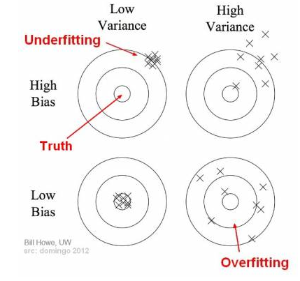
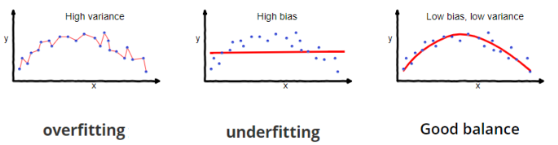

# What is ML about
Machine Learning is getting computers to program themselves. If programming is automation, then machine learning is automating the process of automation. It's [software 2.0](https://medium.com/@karpathy/software-2-0-a64152b37c35).

More specifically, ML is about making observations about uncertain world, using statistics, not logic to analyze results of the experiments. A lot of it boils down to a simple function approximation and in general approximating underlying mapping function from inputs to outputs - there's input data, output data and some unknown underlying correlation that we want to capture.

## It's crutially important to:
- Understand the problem domain (have some prior knowledge), have clearly defined goals
- Get one with the dataset representing the problem - know how to collect it, clean it
- Know what algorithms/approaches to use
- Know how to evaluate performance of the model and interpret its results

## Types
- Supervised: labeled corpus of data, then prediction
    - Processes: **Classification**, **Regression**
- Unsupervised - exploring structure, extracting insights, detecting patterns
    - Processes: **Clustering** and **Dimensionality reduction**
- Semi-supervised - limited set of labeled sample data, partially training a model
    - crawling engines, image/speech analysis
- Reinforcement learning

## Relationship to other fields
* **Pattern recognition** - is the process of recognizing patterns by using a machine learning algorithm

## Important concepts

#### Bias-Variance tradeoff
**Bias** is the difference between an average prediction which a model gives and the correct value we're trying to predict. Variance is the variability of the model predictions, tells us the spread of the data. High bias is associated with **underfitting**.

Model with high bias pays little attention to training data and oversimplifies, model with high variance pays a lot of attention to training data, overcomplicates and leads to high errors on testing data. High variance is associated with **overfitting**.

The term itself - Bias-Variance tradeoff - is used to describe the attempt to find a good balance between these phenomena that go against each other (one makes the model more complex, while other makes it less complex).

## Sources
* [Top 6 errors novice machine learning engineers make](https://medium.com/ai%C2%B3-theory-practice-business/top-6-errors-novice-machine-learning-engineers-make-e82273d394db)
[Basic Concepts in Machine Learning](https://machinelearningmastery.com/basic-concepts-in-machine-learning/)
* [4 TYPES OF MACHINE LEARNING ALGORITHMS](https://theappsolutions.com/blog/development/machine-learning-algorithm-types/)
* https://towardsdatascience.com/understanding-the-bias-variance-tradeoff-165e6942b229