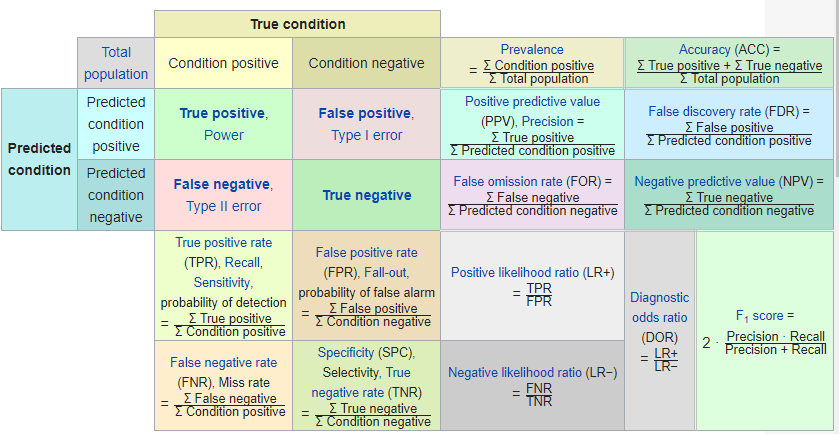
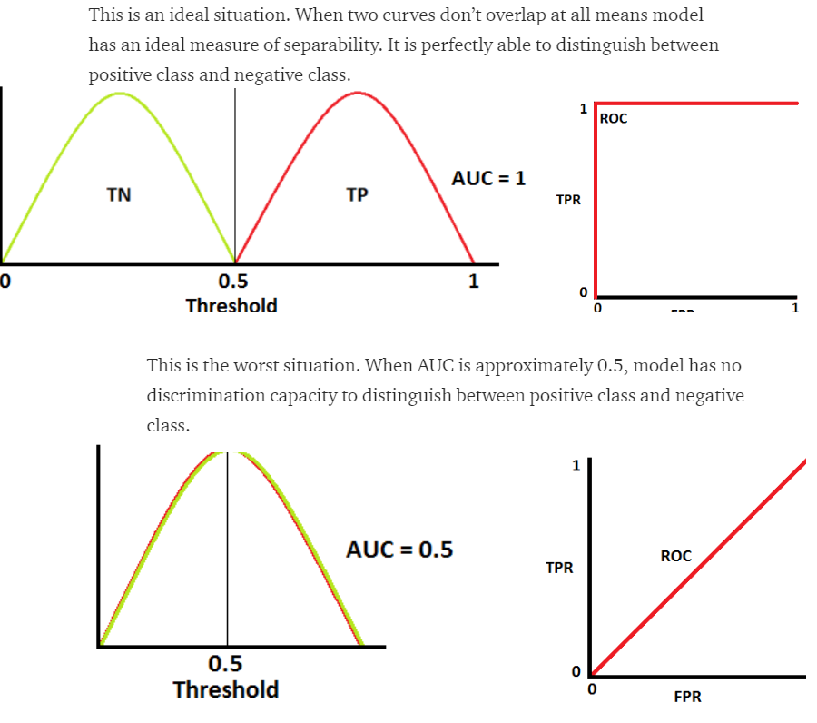
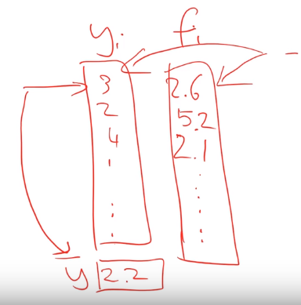

# Intro
Performance evaluation is an essential step in any machine learning project. Without it we have practically no guarantee about whether the model is good or we'd just be better off with random guessing.

## (Classification) Accuracy
Accuracy is a simple metric that's easily understandable and available in all ML tools.

$$Accuracy = \frac{# corrent predictions}{# all predictions}$$

### Disadvantages
Accuracy can be misleading, especially when there's a **class imbalance** (= pos or neg ecamples are extremely rare).

**Example of a class imbalance: Tumor classifier**
Let's say we have a model classifying tumors as benign/malignant. We evaluate the accuracy of it and it comes out to 91%. Great, right?
Not so fast.

Of 100 tumor examples, 91 are benign, 9 are malignant. If of the 91 benign examples, 91 are identified as benign and only 1 malignant correctly identified as malignant, the model didn't do such a great job after all.

## Logarithmic loss
Works well with multi-class classification by penalizing false classifications:
$$LogLoss = -\frac{1}{N}\sum_{i=1}^{N}\sum_{j=1}^{M}y_{ij}*log(p_{ij})$$
- $$y_{ij}$$ - sample belongs to class j or not
- $$p_{ij}$$ - probability of sample belonging to class j
## TP/FP, Confusion matrix
### Precision = TP/(TP+FP)
    - when model said 'positive', was it right?
    - raising classification threshold (probably) increases precision
From the tumor example, precision would be 0.5
### Recall = TP/(TP+FN)
    - out of all possible positives, how many did model correctly identify?
    - raising classification threshold decreases/doesn't affect precision
From the tumor example, recall would be 0.11

These 2 metrics need to complement each other, because they go against each other. I therefore cannot say anything about how good the model is based on precision only.

### Confusion matrix
is a table used to describe performance composed of TP,TN,FP and FN

All the relevant metrics and their relationships (contains confusion matrix and other metrics that can be derived from it):

## ROC (Receiver operation characteristic) curve
A metric that looks at the model across all the possible classification thresholds. Plots TPR vs. FPR.

ROC is a curve of probability. The distributions of the probabilities in ideal and worst scenario:

- True Positive Rate (TPR) = TP/(TP+FN)
- False Positive Rate (FPR) = FP/(FP+TN)

## AUC curve = Area under ROC Curve
Gives an aggregate measure across all possible classification thresholds. It's used for binary classification problems. AUC of the classifier is the probability that the classifier will rank a randomly chosen positive example higher that a randomly chosen negative example.

## R^2 - coefficient of determination
Tells us how much variance in the data is explained by the model
$$R^2 = 1 - \frac{sum(y_i-y_{mean})}{sum(y_i-f_i)}$$

- range of values: (-inf, 1), perfect model: 1

## Other
- F1 score
- mean absolute error
- mean squared error

# Sources:
- https://en.wikipedia.org/wiki/Positive_and_negative_predictive_values
- https://towardsdatascience.com/metrics-to-evaluate-your-machine-learning-algorithm-f10ba6e38234