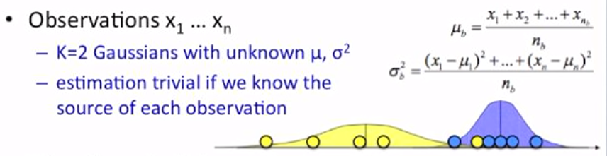
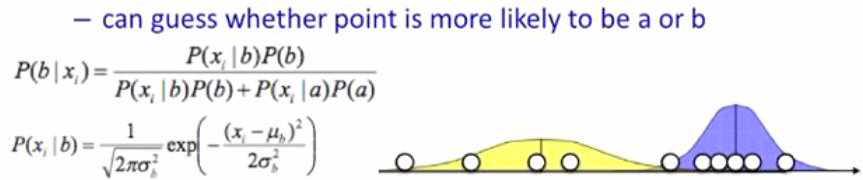

# Mixture models
There are 2 type of clustering methods - **hard clustering** = element either belongs or doesn't and **soft clustering** = there is a strength of association between clusters.

**Mixture models** - probabilistically-grounded way of doing *soft* clustering. Each cluster corresponds to a probability distribution. Its parameters are unknown - we want to find them.

Using the **EM algorithm** we infer the PD's parameters.

### Mixture models in 1D
- observations x_1, ..., x_n
- K=2 Gaussians with unknown $$\mu$$ and $$\sigma^2$$
#### We know which points correspond to which distribution
- simply calculate the mean and the variance

#### We don't know which points correspond to which distribution
- if we knew the parameters of the Gaussian, we can guess whether a point is likely to be gaussian a or gaussian b

## EM Algorithm
Idea: Start with 2 randomly placed Gaussians. For each point calculate $$P(b|x_i)$$, does it look like it came from b? - that's why it's soft clustering - each point is represented by prob. that it came from this/other distribution. Once it has these numbers, it'll recalculate means and variances to fit the points better. Keep iterating until convergence