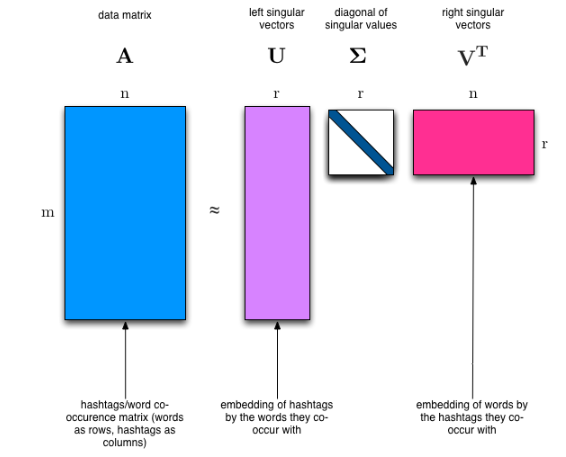
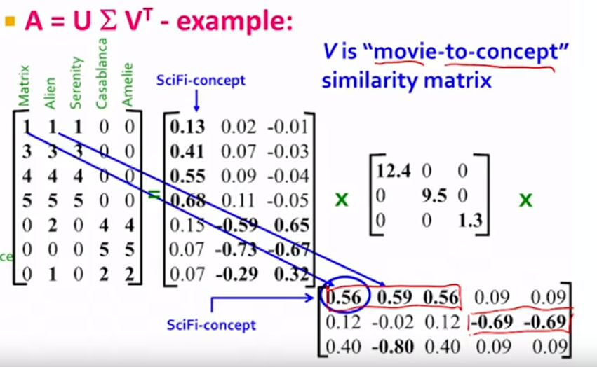

# SVD and NMF
- both data dimensionality reduction techniques working on slightly different principles.
- used e.g. in NLP

## Singular value decomposition (SVD)
Matrix decomposition, widely used in linear algebra and in NLP (DS) for: semantic analysis, recommendations, PCA

I have a matrix of `[m x n]` e.g. each row represents a document and each column represents a word, the values are then 0 and 1 for 'occurs'/'doesnt occur'.

Factorizes a matrix into 3 matrices:
- (U) Left singular vectors `[m x r]`, where `r` represents different topics
- (\sigma) Matrix of singular values = diagnoal matrix (`[r x r]`) 
- (V^T) Right singular vectors `[n x r]`

It's always possible to do this decomposition.
Properties:
- U, V are **column orthonormal = U^T*U = I, have euclidean length 1** 
    - also **orthogonal = inner product is 0 between different columns**

### Example - movies-users-topics

We have `m` users, `n` movies, `r` topics. The user-to-movie similarity is captured in the original matrix. user-to-topic `U` matrix, `\sigma` captures strength of the topic, `V` the movie-to-topic concept.

## Non-negative matrix factorization (NMF)
Rather that constraining factors to be orthogonal, constrain them to be non-negative. Positive factors are oftentimes more interpretable.
The original matrix cannot be recovered

$$X \approx WH$$

Matrix `W`can be thought of as a matrix of weights of `H`, a matrix of components.

How to find it?
- minimize ||X-WH||^2 w.r.t W,H, s.t. W,H > 0

## Shortcomings of classical algorithms for decomposition:
- Matrices are "stupendously big"
- Data are often missing or inaccurate. Why spend extra computational resources when imprecision of input limits precision of the output?
- Important to take advantage of GPUs.

### Solution: Randomized SVD