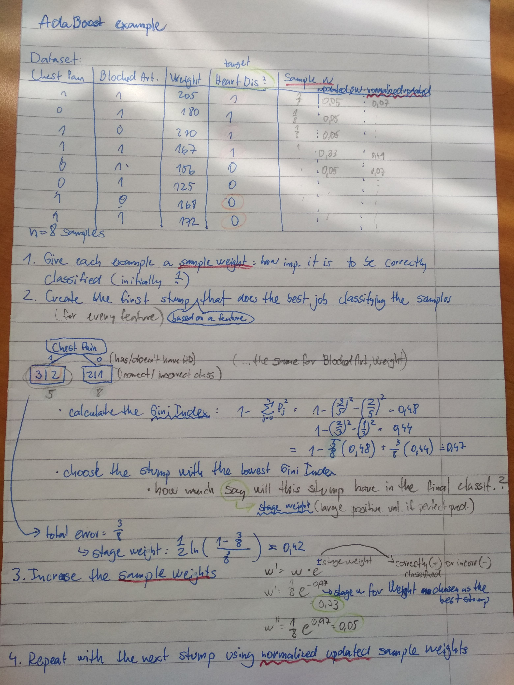
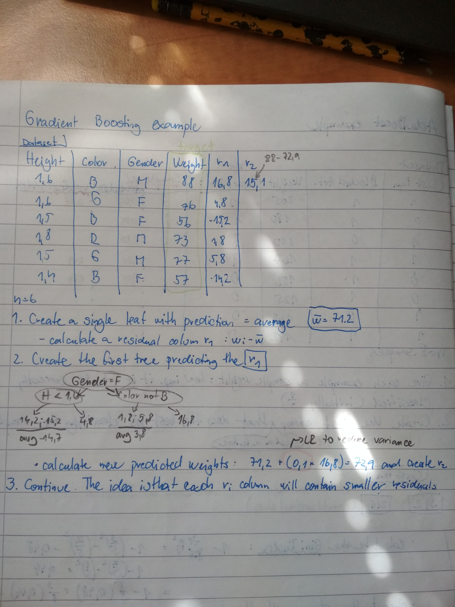

# Bootstrapping, Boosting, Bagging
Bagging and Boosting are both Bootstrapping methods used in model ensembles (e.g. AdaBoost)

## Bootstrapping
Random sampling of the dataset with replacement (= the sample is then returned to the dataset). Each "resample" then contains different characteristics.

Why?
- Reduces overfitting, mainly  for small datasets
- increases robustness of the predictions
- leads to more stable predictions

## Bagging (bootstrap aggregating)
Bagging is a technique used in ensembling decision trees into random forests. 

### It's based on the following idea:
What if we created more different models, each of which is only somewhat predictive and their predictions **wouldn't be correlated with each other** - each of them would have different insights into the relationships of the data. Take the average of them, bringing the insights of each of them together. This is more or less the general idea behind ensembling.

### Insight of bagging:
 **Each decision tree is fitted on a  different bootstrap**.
They are terrible - all overfit - but all of them overfit on different data -  different things.
**BUT** If we take the average of these trees, each of them being trained on a different subset, the errors will average out to zero.

Why?
- reduces variance (overfitting)
-

# Boosting
Boosting is an ensemble technique that creates one strong classifier from a number of weak ones (usually *decision stumps*). It's based on adding weak classifiers to correct classification error. Each subsequent classifier is made by taking into account errors from the previous one. **Adaboost** was one the first successful boosting algorithms developed.

## Process:

0. associate a weight with each training example, initially:
    - $$weight(xi) = 1/n$$
1. Start with a weak classifier, calculate the weighted misclassification rate:
    - $$error = sum(w(i) * terror(i)) / sum(w)$$ 
2. Calculate stage weight to amplify the contribution of more accurate models to the final prediction:
    - $$stage = ln((1-error) / error)$$
3. Update training weights giving more weight to incorrectly classified ones:
    - $$w = w * exp(stage * error)$$
- between 0 for perfect stump, 1 for horrible stump

Predictions are then made by calculating weighted average of the weak classifiers.

Example:

## Gradient boosting
Generalization of AdaBoost allowing for arbitrary differentiable loss function to be used and expadning the use cases beyond binary classification
- decition trees are still used as weak classifiers
- gradient descent is used to minimize a the loss of a tree (parametrizing the tree, modifying the parameters)

### Reducing overfitting
Overfitting is a major problem in gradient boosting, since it's a greedy algorithm that can easily overfit on the dataset:

- tree constraints - n of trees, depth, minimum improvement to loss
- stochastic gradient booting - to use **bagging** too = random subsampling of training data, the subsample is used as training data for the base learner
- if regression trees are used, L1/L2 regularizations can be employed

## Procedure
Instead of starting with building a stump and continuing with the next stump based on the errors that the previous one made, Gradient boost starts with 
1. making a **single leaf** = initial guess (average value)
2. **tree is built** (8-32 leaves in practice), this process is the same as in AdaBoost - subsequent fixed-sized trees are built based on the errors ("**pseudo-residuals**") of the previous ones

Example:
