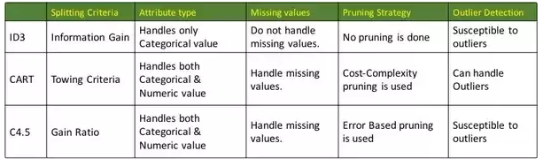

# Decision trees
Decision tree is a tree-shaped diagram that determines a course of actions (if-then decisions). Each branch represents a possible decision.
Idea: divide the data set into smaller data sets based on features until you reach a small enough set that contains data points that fall under one label (they are considered **"pure"**)

**Terms:**
* **Impurity** - impurity of elements in the set, based on [Shannon's entropy model](https://en.wikipedia.org/wiki/Entropy_(information_theory))
* **Prunning** - limiting tree depth to reduce overfitting
* **Splitting** - separating a part of the dataset to be considered in a child node in constructing the tree
* **CART** - generic tree-growing framework (algorithm)

### Constructing a tree
1. start with the root and choose the attribute that best splits the data. That part is subsequently **split into smaller parts*** until a **termination criterion**
is met. A termination criterion could be, for example, that all objects be labeled correctly. 
3. Having constructed a perfect tree we have to **prune** it to counter overtraining
(called also postpruning). Alternatively, we may use some measurable objective
function to decide when to stop splitting (called also prepruning).

### \* exactly how the split will be performed is decided by a specific algorithm used:

### Practical example

## Advantages of Decision Trees
* easy to interpret - the decision process can be traced as a sequence of simple decisions

## Disadvantages
* overfit on noisy data

# Ensembling decision trees = Random Forests
In ML we create so-called **ensembles** of several smaller models to generate better final preciction.

Idea in regards to combating overfitting of decision trees: Combine several decision trees using **bagging**

### Bagging
What if we created more different models, each of which is only somewhat predictive and their predictions **wouldn't be correlated with each other** - each of them would have different insights into the relationships of the data. Take the average of them, bringing the insights of each of them together. This is more or less the general idea behind ensembling.

Insight of bagging: **Each decision tree is fitted on a different random subset of the data (= different bootstrap)**.
They are terrible - all overfit - but all of them overfit on different data -  different things.
**BUT** If we take the average of these trees, each of them being trained on a different subset, the errors will average out to zero.

Properties:
- random forests work best when train and test set have very similar properties

Random forests are a **great universal learner**. They work well with categories and continuous output variables. In general it doesn't overfit, has few if any statistical assumptions (doesn't assume normally distributed data). If a random forest does poorly on me, that's a sign there's some problem with the dataset.

## Sources:
* *Combining pattern classifiers*
* [Decision Trees on hackerearth](https://www.hackerearth.com/practice/machine-learning/machine-learning-algorithms/ml-decision-tree/tutorial/)
* [ID3,C4-5,CART](https://www.quora.com/What-are-the-differences-between-ID3-C4-5-and-CART)
* https://www.youtube.com/watch?v=7VeUPuFGJHk&t=763s