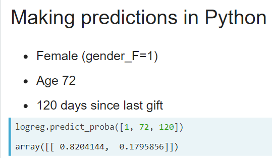
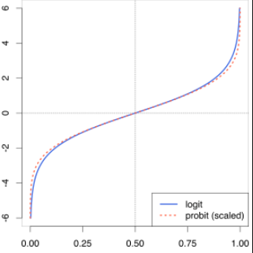
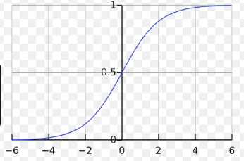
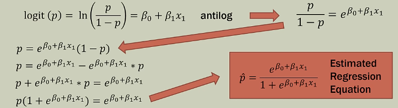
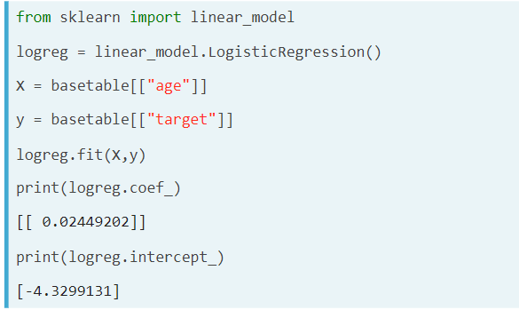

# Intro
Logistic regression is a predictive modelling technique suited for binary classification problems, because its output is not a categorical variable, but rather a probability score that reflects the probability of the occurence of the event.

## Goals: 
* **Model the probability** of an event occuring based on the values of independent variables
* **Prediction:** Estimate the probability that event occurs for a new observation
* **Estimation:** Using Maximum likelihood estimate

## Example problem:
A bank giving mortgages based on applicants' credit scores. 
* Feature: `creditScore` (numerical)
* Target feature: will the mortgage be approved? (boolean)

Questions that Logistic Regression tries to answer:
- what is the prob. of an applicant having a score of 670 to be approved?

**Why can't we use linear regression in Example problem?**
* Visually, there's no way to 'fit a line' = the examples are scattered along 0 and 1 (target features). 
* Linear regression's output is a quantitative variable, in Logistic Regression is a boolean one (or a problability).
* Binary data doesn't have normal distribution, which is an assumption for most types of regression (hence the visual discrepancy hinted at in point 1)

## Terms:
* **(In)Dependent variables**
    - dependent variable follows Bernoulli distribution (spec. case of binomial distribution where n=1) having an unknown probability p.
    - independent variables are our examples
    - **in Logistic Regression we're essentially trying to find a link between the independent variables (linear combination of them) and the dependent ones (0 or 1) represented by the Bernoulli distribution** (the link is called **logit**)
* **Logit:** Natural log of odds: $$ln(odds) = ln(\frac{p}{1-p}) = ln(p) - ln(1-p) = logit(p)$$

    - when the odds are even, logit returns 0
* **Inverse of logit = Sigmoid** is $$logit^{-1}(\alpha) = \frac{e^a}{1+e^a}$$. $$a$$ being the linear combination of indep. variables. Inverse logit will return the probability of being a "1"
    - 
* Interpreting logistic regression's output: **odds ratio** - represents how the odds change with a 1 unit increase in a variable holding all other variables constant (FICO score)
    * Example: Predicting sleep apnea from body weight (BW). Odds ratio: 1.07. Interpretation: One pound increase in BW increases the odds of having apnea by 1.07
* **Estimated regression equation:**
    - 
**Classification vs. Regression in Logistic regression**:
Plain Logistic Regression does regression: It's output would be that a spam probability is 0.8. In classification tasks we'd decide to label something as spam, given it's spam prob. is 0.8 (= classification threshold).

## Likelihood function and Log loss
Both are classification metrics based on probabilities, Log Loss is just a negative logarithm of likelihood function that's computationally more efficiet (we're multiplying a lot of numbers in (0,1) range).

Likelihood Function:
- Example: Model predicted probabilities of `[0.8, 0.4, 0.1]` for three houses. The first two houses were sold, and the last one was not sold. So the actual outcomes could be represented numeically as [1, 1, 0].
    - likelihood would be computed as a product of indep. variables: `0.8 * 0.4 * 0.9`
- Log likelihood function (binary cross-entropy):
    - $$LL = \sum_{(x,y)\in D} -ylog(y') - (1-y)log(1-y')$$
- all of this is assuming a Bernoulli distribution.

## Advantages
- easy to understand/interpret - assigning probability score to observations

## Disadvantages
- unable to handle a lot of features
- prone to overfitting
- performs poorly when features are correlated

## Contrast with Linear regression

### Estimation
Linear regression is estimated using **Ordinary Least Squares (OLS)** while logistic regression is estimated using **Maximum Likelihood Estimation (MLE)** approach. Maximizing the likelihood function determines the parameters that are most likely to produce the observed data. From a statistical point of view, MLE sets the mean and variance as parameters in determining the specific parametric values for a given model. This set of parameters can be used for predicting the data needed in a normal distribution.

Ordinary Least squares estimates are computed by fitting a regression line on given data points that has the minimum sum of the squared deviations (least square error). Both are used to estimate the parameters of a linear regression model. **MLE assumes a joint probability mass function**, while OLS doesn't require any stochastic assumptions for minimizing distance.

## Logistic regression in sklearn

## Notes
- Neural net with one layer is basically a logistic regression

## Sources:
* https://www.youtube.com/watch?v=zAULhNrnuL4&t=26s
* https://www.machinelearningplus.com/machine-learning/logistic-regression-tutorial-examples-r/
* https://www.youtube.com/watch?v=BfKanl1aSG0