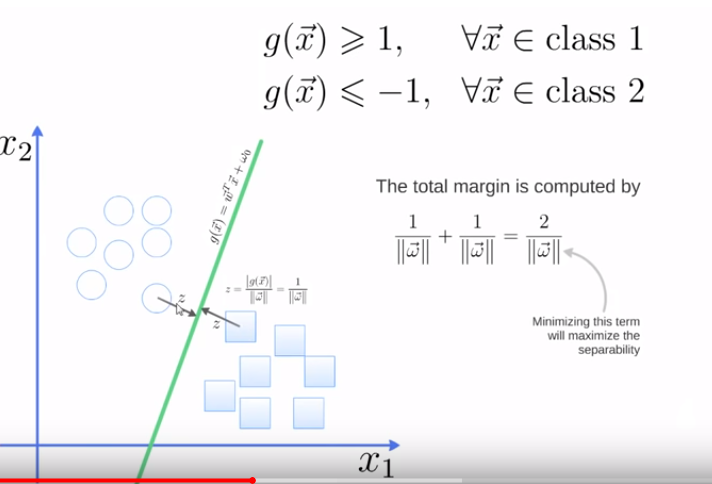
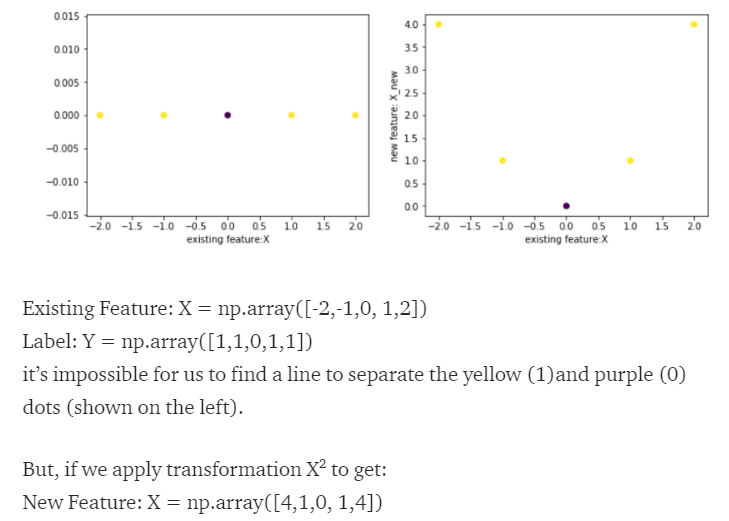
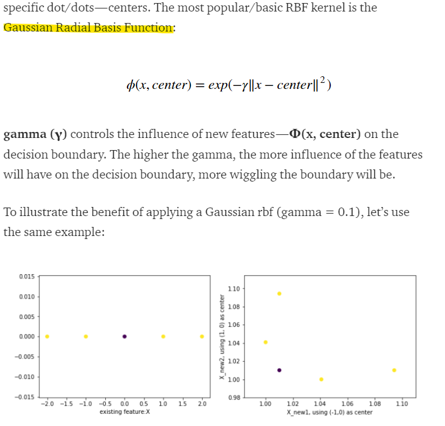

# Support vector machines
- **Goal:** Find a hyperplane (= a **decision boundary**), in an N-dimensional space (# of features) distinctly classifying the data points.

- How?: By finding the **maximum margin** using subset of training points that define it (= **support vectors**)

    - $$w$$ is minimized by Karush-Kuhn-Tucker conditions, using Lagrange multipliers

To make a prediction for a new point the distance to each of the support vectors is measured (using a **kernel (Gaussian kernel in default SVC in sklearn)**) and importance of support vectors is taken into consideration.

## Linearly separable case
- ensure that each observation is on the correct side of the Hyperplane
- Pick up the optimal line so that the distance from those closest dots to the Hyperplane, so-called margin, is maximized

## Non-Linearny separable case
Most of the real-world datasets are not linearly separable. There cases are dealt with using:
- **Soft Margins**:  try to find a line to separate, but tolerate one or few misclassified dots (e.g. the dots circled in red)
    - we're consideting co-called **degree of tolerance**
- **Kernel Trick** - find a non-linear decision boundary (in sklearn linear, poly, rbf, sigmoid)
    - 
    - 

**Support vectors** are data points that are closer to the hyperplane and influence the position and orientation of the hyperplane.

The loss function that helps maximize the margin is **hinge loss**.

## Advantages
- Effective in high dimensional spaces
- Different kernel functions for various decision functions

## Disadvantages
- poor performance when `# features > # samples`

## Sources:
- https://towardsdatascience.com/support-vector-machine-introduction-to-machine-learning-algorithms-934a444fca47
- https://towardsdatascience.com/support-vector-machine-simply-explained-fee28eba5496