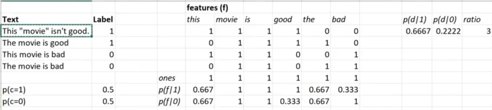

# Intro

## Terms

### Bag-of-words
Representation of a text where the order of the words doesn't matter. Convenient e.g. for linear models - the output is a matrix.
- `CountVectorizer` from `sklearn.feature_extraction.text`

We calculate the prob. of class, given the data by:

$$\frac{p(C=1|d)}{p(C=0|d)} = \frac{p(d|c_1)*p(c_1)}{p(d|c_0)*p(c_0)}$$

The probabilities of classes are just averages of the label column (and 1-that)

### Lemmatization, stemming

### Topic modeling (Latent semantic analysis)
- uses SVD, NMF (see Dimensionality redction section)

#### Term frequency-inverse document frequency (Tf-idf)
A way to normalize term counts by taking into account frequency of their appearance
