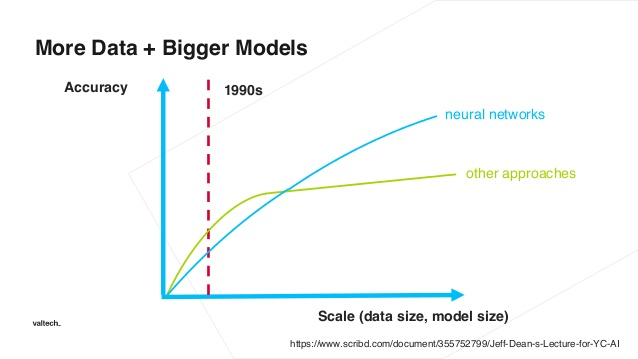

[IN CONSTRUCTION]
# Intro
Neural networks are a class of mathematical functions that support the Universal Approximation theorem, meaning it can approximate any other function, arbitrarily closely.

Stacking layer on one another is powerful itself, but stacking nonlinearities on nonlinearities lets us model very complicated relationships between the inputs and the predicted output.

* more [TODO]: http://colah.github.io/posts/2014-03-NN-Manifolds-Topology/

## Difference between DNN and traditional ML

## Reasons for underperformance
### Data is unbalanced
Solution: **Data Optimization**
- Subsampling of majority class
- Oversampling of minority class
Read more [here](http://amsantac.co/blog/en/2016/09/20/balanced-image-classification-r.html).

### There is little data
Solution: **Generate more**
- More [here](https://medium.com/nanonets/how-to-use-deep-learning-when-you-have-limited-data-part-2-data-augmentation-c26971dc8ced)

### Hyperparameters are not properly optimized
- [Hyper-Parameter Optimization](./Hyperparameters.md)

## Goal of training a neural network
A trained net is a point in multidimensional weight space. There are infinite combinations of weights for every model. Our goal is to find such combination which minimizes loss function on both training and testing datasets.