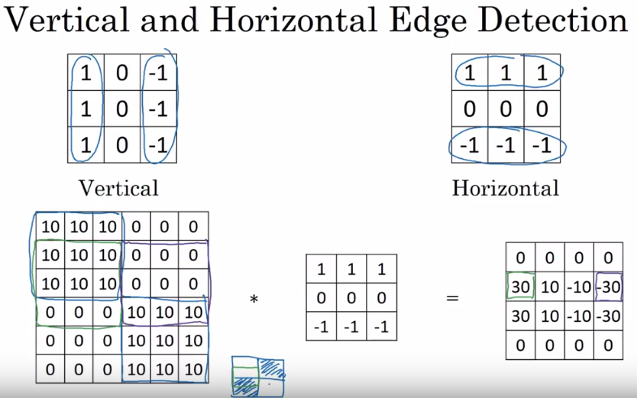

# CNNs
Used mostly in the field of Computer Vision - one of the more rapidly advancing fields.
Applications: Image Classification, Object detection, Neural style transfer

## Challenges
Datasets can be very large

## Terms
### Convolution
Involves passing a filter over an image in order to change the underlying image.

- **problem 1:** everytime we apply a (smaller) filter to an image, the image shrinks (e.g. 6x6, filter 3x3, shrinks to 4x4 -> 6-3+1), **problem 2:** pixels in corners are used little if more than once, compared to pixels in the center **solution: padding** - a lot of the times, so-called **"sane" padding** is used: pad so that the output size is the same as the input size.
- **Pooling**

## Non-linear transformations
- **sigmoid** (also logistic function, see Logistic Regression)
- **softmax** - represents class probabilities

## Losses
### Binary Cross-Entropy Loss 

$$CE = -\sum_{i=1}^{C'=2}t_{i} log (s_{i}) = -t_{1} log(s_{1}) - (1 - t_{1}) log(1 - s_{1})$$

implementations:
- https://www.tensorflow.org/api_docs/python/tf/losses/log_loss
- https://pytorch.org/docs/master/nn.html#bceloss

### Cross-Entropy Loss (Categorical)
- used for multi-class classification

$$CE = -\sum_{i}^{C}t_{i} log (s_{i})$$

implementation:
- https://pytorch.org/docs/master/nn.html#crossentropyloss
- https://www.tensorflow.org/api_docs/python/tf/losses/softmax_cross_entropy
