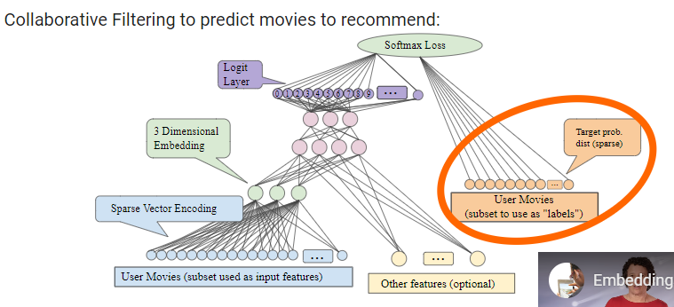

# Intro
Data can be captured using d-dimensional space, where each dimension represents a particular aspect and data point's value in that dimension represents how much does it fit into the aspect. 
- large sparse vectors into a lower-dimensional space that preserves semantic relationships

## Collaborative filtering 
Is the task of making predictions about the interests of a user based on interests of many other users.

## Embeddings in DNNs - Embedding layer, otherwise nothing special

### Representation
- sparse vectors (e.g. list of movies a user has watched, a movie is represented by an integer)

### Additional hyperparameter of number of embeddings
- rule of thumb: dimensions ~ sqrt_4(possible-values)

### Collaborative filtering architecture for movies recommendation example

- i have 10 movies a user watched, i'll use 3 of them as labels, the rest will be input features (+ other features).