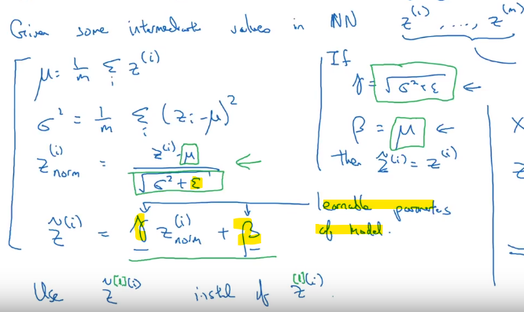

# Regularization techniques

# Normalization techniques

## Batch normalization
**Intuition:** We can see how scaling the input features to mean 0 and variance 1 helps speed up the training. Batch norm is a similar thing for values in the hidden units.
Example: If i train a model on only black cats and then expect it to detect colored cats, the model wouldn't do well, because the **data distribution changed**. This is known as **Covariate shift** = when the distribution changes, i need to retrain (i.e. train on colored cats as well).

Because the weights change all the time, activations in hidden layers suffer from  **Covariate shift** as well. Batch normalization reduces it. "Batch" because if used as a regularization tehcnique, each mini-batch is scaled by its mean/variance computed on just that 1 mini-batch.

