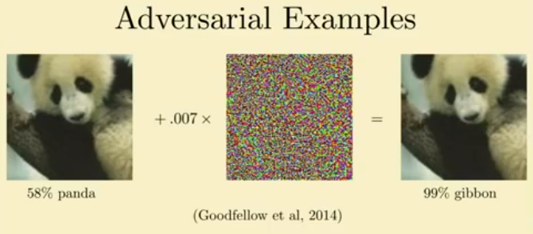

## Adversarial examples
Subtle modification of input can have dramatic effect on predicted class label.

Simple real world manipulations are enough for the i.i.d assumptions to be broken
- can be misused by an attacker to misclassify a sample
- solutions:
    - [adversarial training](../Adversarial&#32;ML.md)

## Causality
- "Though machine learning methods excel in describing the real world, they are often lacking in understanding the world. This is nicely illustrated by the fragility of deep neural networks. "
### Pearl's lader of causality:
- **association:** "What is the expected lifespan of somebody who is vegetarian and does not smoke?"
    - ML algorithms can answer this
- **intervention:** "How would my expected lifespan change if I become a vegetarian?"
    - requires more mechanistic understanding of the system
- **imagining:** "Would my grandfather still be alive if he did not smoke?"
    - intricate understanding of the system and how everything is linked together

# Sources / more:
- https://michielstock.github.io/causality/
- https://en.wikipedia.org/wiki/Bayesian_inference
- https://www.youtube.com/watch?v=sLAi-H9J3nk
