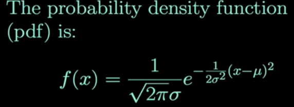
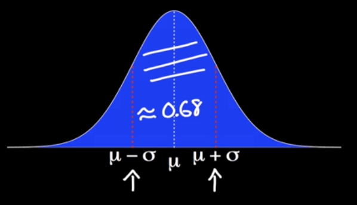
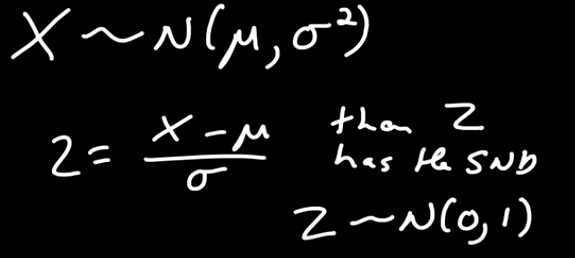
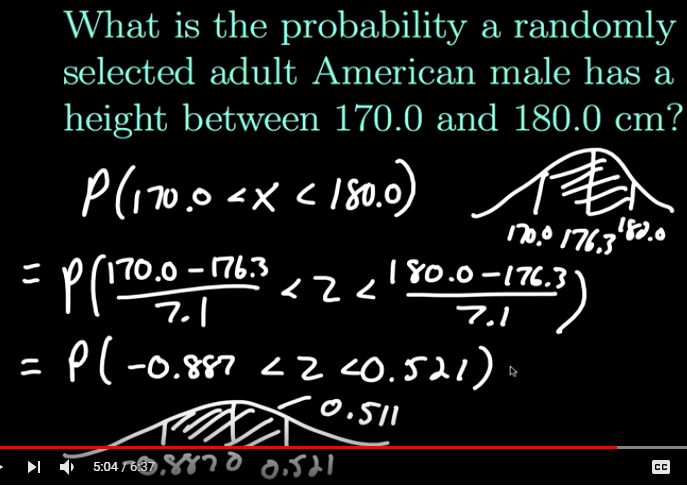

# Distributions

## Normal distribution
Important continuous probability distribution.
Plot: variable and probability density function

Probability density function:

~68% of the area lies withing 1 standard deviation of the mean:

~95% of the area lies withing 2 standard deviations of the mean.

The **standard normal distribution (Z)** is a normal distr. with mean 0 and variance 1.

What we often so is we're trying to find areas under the standard normal curve (probabilities), this requires integrating pdf (non-trivial), but we can approximate the solution via tables/software.

**z-score** - how many standard deviations is a value away from the mean?
- formula: (value-mean)/stddev

### Approximating binomial distribution using normal distribution
Binomial distr.: Bi(n,p) is a discrete prob. distr. that we want to approximate.
Why? Useful in statistical inference.
How? Set $$\mu = n*p$$ and $$\sigma = n*p(1-p)$$

Works best if p is ~0.5

### Standardizing normally distributed random variables
- forcing quantities to have the mean of 0 and stddev of 1

## Sources
- https://www.youtube.com/channel/UCiHi6xXLzi9FMr9B0zgoHqA

## Central limit theorem
We can start off with any distribution. Any random arbitrary distribution.

Sample size: n = 4, let's draw a few samples: 
- S = 1,1,3,6. mean = 2.75
- S = 3,4,3,1. mean = 2.75
- S = 1,1,6,6. mean = 3.5

A couple of these means, plotted by their frequency will resemble a normal distribution.

If we set n=20, the same thing will happen, but the distr. will have smaller standard deviation.

As  the sample size approaches infinity, we get closer to normal distribution.