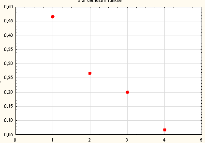
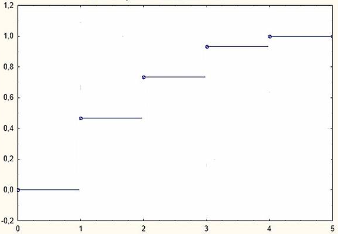
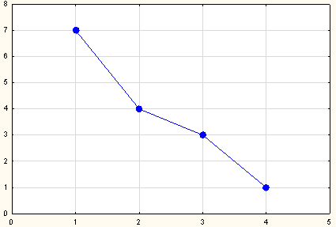

## Frequency
Frequency of an event captures number of times the event occured, often portrayed in histograms
- absolute frequency
    - $$n_j = card\{j; x=x_[j]\}$$
- relative frequency
    - $$p_j = \frac{n_j}{n}$$
- Absolute cumulative frequency of first $$j$$ cases:
    - $$N_j = n_1 + ... + n_j$$
- Relative cumulative frequency of first $$j$$ cases:
    - $$F_j = \frac{N_j}{n}$$

Example: How many packs of cigarettes do smokers use per a unit of time?

|   |   |   |   |   |
|---|---|---|---|---|
|# Packs|1|2|3|4|
|# Smokers|7|4|3|1|

also can be represented in an interval form:
|   |   |   |   |   |
|---|---|---|---|---|
|Expenses|(50;100>|(100;150>|(150;200>|(200;250>|
|# Smokers|18|7|13|7|

**A frequency distribution table:**
|$$x_[j]$$|$$n_j$$|$$p_j$$|$$N_j$$|$$F_j$$|
|---|---|---|---|---|
|1|7|$$\frac{7}{15}$$|7|$$\frac{7}{15}$$|
|2|4|$$\frac{4}{15}$$|11|$$\frac{11}{15}$$|
|3|3|$$\frac{3}{15}$$|14|$$\frac{14}{15}$$|
|4|1|$$\frac{1}{15}$$|15|1|

Observations:
- i'll get x_j and n_j from the original problem description table
- sum of p_j must = 1

## Graphs
- graph of the frequency function


- graph of empirical distribution function (= cumulative distribution function)

- frequency polygon graph

# Sources
- [czech] https://is.muni.cz/do/rect/el/estud/prif/ps15/statistika/web/pages/zakladni-a-vyberovy.html
- https://en.wikipedia.org/wiki/Frequency_(statistics)

# Appendix
- inverval frequencies (distributions):
```
data <- read.csv (file = "dataset.csv", header = TRUE, sep = ",", dec = ".")
str (data)
d.j <- data$delimiter.h - data$delimiter.d
middles <- (data$delimiter.d + data$delimiter.h) / 2
str (middles)
r <- nrow (data)
n.j <- data$sum
n <- sum (n.j)
p.j <- n.j / n
sum (p.j)
N.j <- cumsum (n.j)
F.j <- N.j / n
```
```
# frequency density
f.j <- p.j / d.j
table <- data.frame (middles = middles, delimiter.d = data$delimiter.d, delimiter.h = data$delimiter.h, d.j, n.j, p.j, N.j, F.j, f.j)
table
barplot (table$n.j, names.arg = paste(table$delimiter.d, "-", table$delimiter.h), xlab = "delimiters", ylab = "sum of observations", main = "column diagram")
# frequency function graph
plot (paste(table$delimiter.d, "-", table$delimiter.h), table$n.j, type = "p", pch = 20, cex = 2, col = "red", xlab = "delimitere", ylab = "frequency function", main = "frequency function")
# polygon graph
plot (paste(table$delimiter.d, "-", table$delimiter.h), table$n.j, type="b", pch = 20, xlab = "delimiters", ylab = "sum of observations", main = "polygon frequencies", col = "red", cex = 2, lty = 2)
barplot (table$p.j, names.arg = paste(table$delimiter.d, "-", table$delimiter.h), xlab = "delimiters", ylab = "sum of observations", main = "column diagram of relative frequencies")
barplot (table$f.j, names.arg = paste(table$delimiter.d, "-", table$delimiter.h), xlab = "delimiters", ylab = "frequency density", main = "column diagram of frequency density")
X <- rep(table$middles, table$n.j)
```
```
# only in interval frequency distributions
hist (X, breaks = c(table$delimiter.d[1], table$delimiter.h), freq= FALSE, col="yellow", xlab = "delimitere", ylab = "frequency density", main = "histogram")
plot (c(0,table$delimiter.d[1],table$delimiter.h,200), c(0,0,table$F.j,1), type="b", xlab = "middle", ylab = "ECDF", main="empirical distribution function", col = "red", lwd = 2)
boxplot (X, horizontal = TRUE, ylim = range (X), main = "boxplo)")
stripchart (X, vertical = FALSE, method = "jitter", pch = 21, col = "red", bg = "yellow", cex = 1.5, add = TRUE)
```