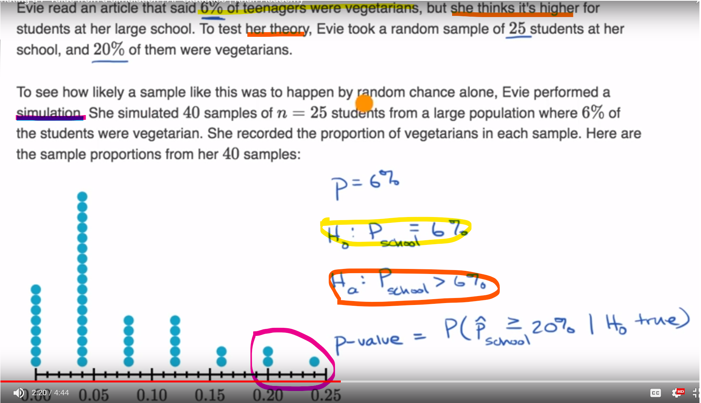

# Statistical hypothesis testing
In any situation where we're interpreting data. To introduce some quality control on the interpretation, we use statistical hypothesis testing, or significance tests.

We do this by introducing a **null hypothesis (H0)** which represents the position that there is no relationship between the measured phenomena (or that the studied phenomenon has no real effect). On the other hand we have an **alternative hypothesis (H1)** stating the exact opposite.

The results are said to be **statistically significant** if the probability of obtaining them given that there is no real effect (i.e. H0 is correct) is <5% (**significance level**).

The process looks like this:
we measure the studied phenomenon statistically = calculate its mean, stddev. Then we ask the following question: Assuming that H0 is true, what is the probability of getting a sample with the measured statistics? (Calculating the p-value)
- if the prob. is lower than our significance level, we reject H0, accept H1
- otherwise we can't reject H0

p- value of the test above would be 3/40

## Type I type II errors
- **Type I** - rejection of the true null hypothesis, i.e. concluding that the effect is real, when, in fact, it is not (false negative)

- **Type II** - failure of rejection of a false null hypothesis (false positive)

A lot of statistical theory revolves around minimization of one/both of these errors, they're often traded off against each other and reducing them completely is not possible.

## Example:
**Hypothesis:** "Adding water to toothpaste protects against cavities."

**Null hypothesis (H0):** "Adding water does not make toothpaste more effective in fighting cavities."

This null hypothesis is tested against experimental data with a view to nullifying it with evidence to the contrary.

A type I error occurs when detecting an effect (adding water to toothpaste protects against cavities) that is not present. The null hypothesis is true (i.e., it is true that adding water to toothpaste does not make it more effective in protecting against cavities), but this null hypothesis is rejected based on bad experimental data or an extreme outcome of chance alone.