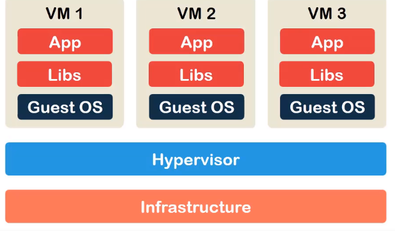

# Docker essentials
### Containers
Containers are an abstraction at the application layer packaging code + dependencies together. Containers ship **application** and **runtime environment** and still remain small-size (less storage consumed - GBs to MBs, easier to ship with all the dep. = code will behave the same everywhere).


In VMs we have a **hypervisor** (+ **host OS** if type 2 hypervisor), **guest OS** requires isolated virtual environment.

In containers: **no guest OS** and **container runtime enrivonment** is used instead of hypervisor. Motivation: all the linux variants share the same kernel (+-), no point in duplicating

### Docker
Docker is a platform for building, shipping and running containerized applications.

**Excercise:** Running a simple nginx web server:
```
docker image pull nginx:latest
docker run -itd -p 8080:80 ngingx:latest
```
- maps port 80 on docker onto 8080 local

### Stages of containerization: Build-Ship-Run

#### Dockerfiles (get built)
- sequential set of instructions to be built by docker daemon, each instruction creates a layer of the final image that'll be built = **layers can be cached and reused**
- fundamental, configuration and execution instructions

##### Example of a Dockerfile:
```
ARG CODE_VERSION=16.04
FROM ubuntu:${CODE_VERSION}

RUN apt-get update -y && apt-get install -y curl

RUN mkdir /home/codes

ENV SHELL /bin/bash
ENV USER terka

CMD ["bash"]
```
* Build: `docker build -t img_ubuntu .`
* Run: `docker run -itd --name cont_ubuntu img_ubuntu .`
    - `--rm`: remove the container once it's finished running
* Verify running: `docker ps -a` - see that it's running a bash command
* **bring the bash command forward**: `docker exec -it cont_ubuntu bash`

#### Docker images (get shipped)

#### Containers (run)

## How does docker work?
**Docker client:** (docker cli, docker API)
**Docker host** - runs docker daemon - builds dockerfile, turns it into docker image.
**Docker registry** - stores docker images
    - search dockerhub: `docker search python:3.6`